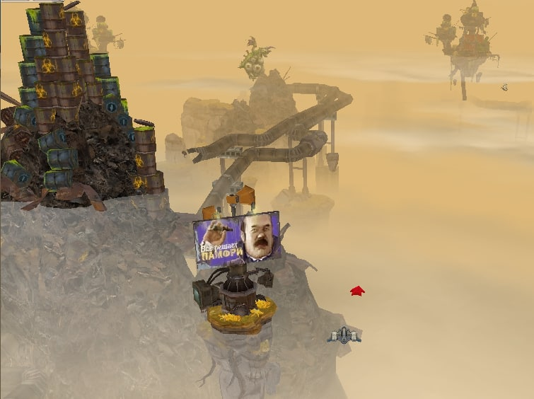
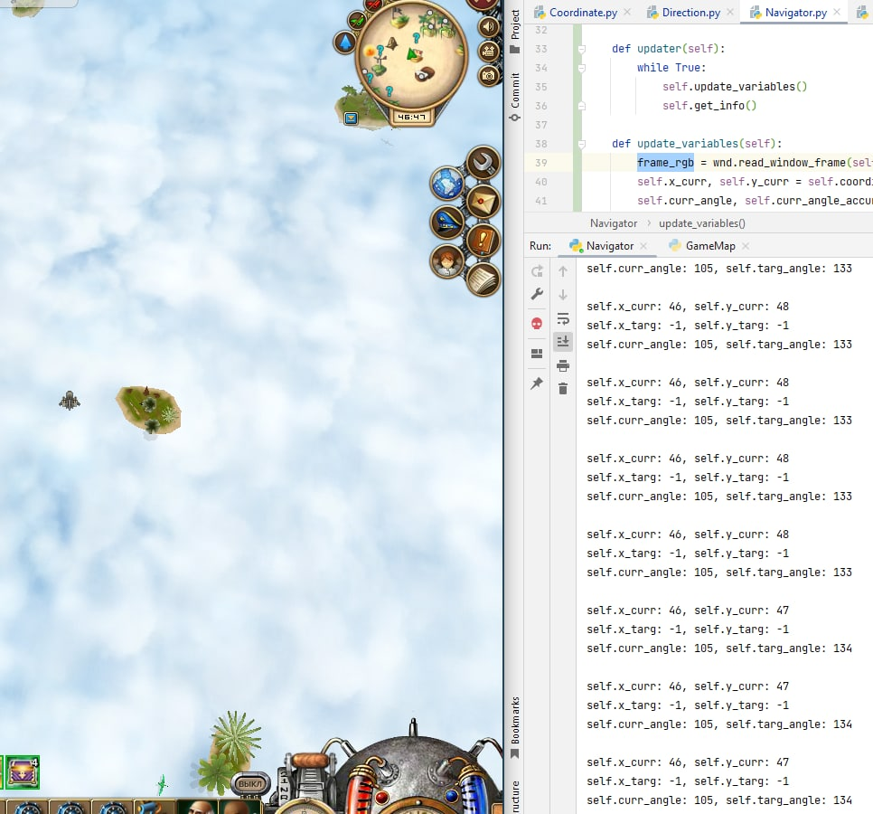

# About game

This project is about an online 3d game, where you have different locations, challanges. You can fly on the map to collect resources from different sources: kill bosses, other players, complete quests, collect minerals, fluffs, fishing, chop some wood and a lot more. 

You can create your clan, buy and place your clan's base on the map (private base). You also have public bases (2-3 for each map). Bases are located at different coordinates of a map so you can faster achive some map`s point.

Without any details, please don't play this game. I made this project because this game is part of my childhood and I was also interested in training in computer vision.

# What I did

In this project I`ve created an CV based bot. It can:
- leave base in given dirrection (360 degree);
- read current ship coordinates on the map and its direction;
- fly to specific coordinates avoiding obstacles;
- find and collect minerals (resources on the map that are placed at specific coordinates so you have to fly to that location from a base);

# Preview

### Here you can see in the top middle screen ship coordinates I read and direction (small arrow in the middle of a circle)

###  Finding all minerals and the one closest to the ship (sorry for video quality, for now I don`t have better one)

###  Flying to minerals

